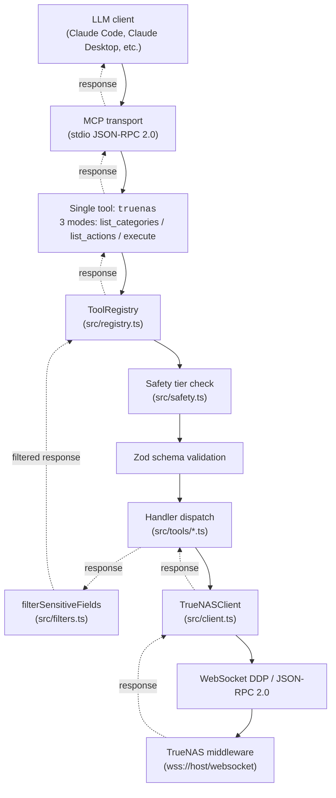
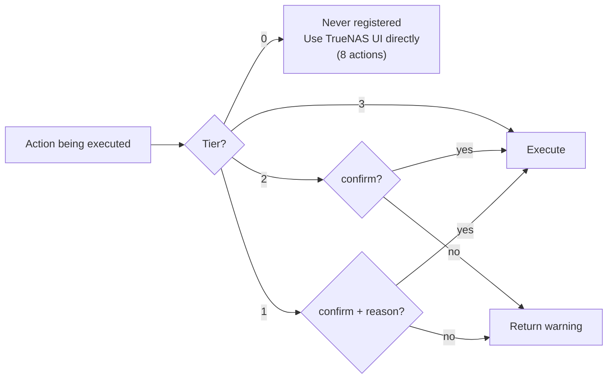
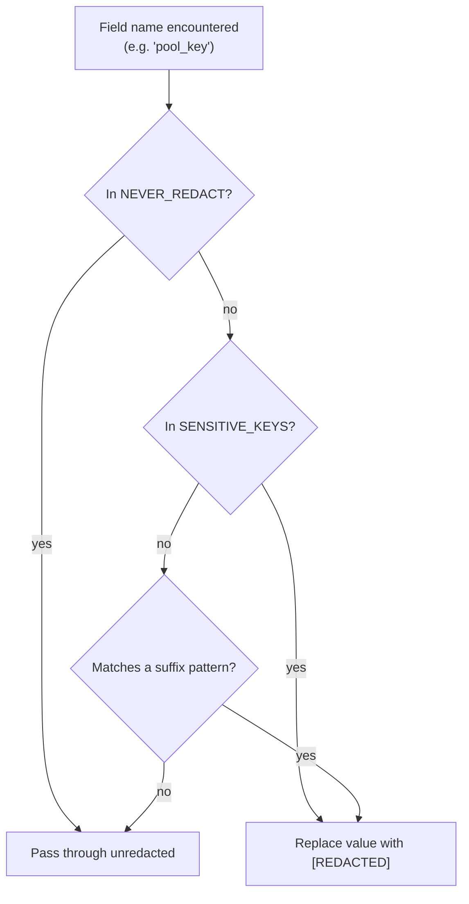
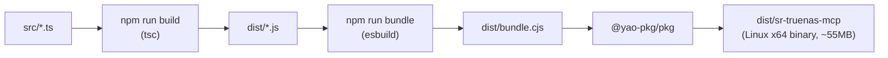

# Architecture

This document is the long-form companion to the [Architecture
section](../README.md#architecture) of the README. The README's
version is what most readers need; this one covers the implementation
in enough detail to navigate the codebase or evaluate the design.

## Topology



The model interacts with **one** MCP tool. The first time it asks
"what's available," it gets a list of 17 categories. Drilling into a
category returns the actions in that category (with tier markers).
Executing an action runs through the registry → safety → schema →
handler → filter pipeline.

## File layout

```
src/
├── index.ts          MCP server setup; registers the truenas tool;
│                     declares destructiveHint + per-action annotations
├── cli.ts            CLI entry: env var parsing, preflight, startStdio
├── mcp-adapter.ts    Sole runtime importer of @modelcontextprotocol/sdk
├── client.ts         WebSocket DDP client — connect, auth, multiplex,
│                     reconnect, job polling
├── registry.ts       ToolRegistry — registration with tier check;
│                     execute() with tier + Zod + filter
├── safety.ts         Pure data: every action name → tier (0/1/2/3)
├── validation.ts     validateTrueNASPath, validateDatasetName
├── filters.ts        filterSensitiveFields — 3-layer matcher
├── resources.ts      12 read-only MCP Resources (filtered)
├── logger.ts         JSON-line stderr logger, gated by env
├── preflight.ts      Startup health check
├── version.ts        Build version (injected via esbuild --define)
├── types.ts          Shared types
├── tools/
│   ├── alert.ts          ~32 actions
│   ├── filesystem.ts     ~38 actions
│   ├── network.ts        ~34 actions
│   ├── replication.ts    ~49 actions
│   ├── sharing.ts        ~36 actions
│   ├── storage.ts        ~32 actions
│   ├── system.ts         ~24 actions
│   ├── vm.ts             ~33 actions
│   └── index.ts          buildRegistry — wires all 8 modules
└── __tests__/
    ├── safety.test.ts
    ├── safety-completeness.test.ts
    ├── registry.test.ts
    ├── client.test.ts
    ├── validation.test.ts
    ├── filters.test.ts
    ├── handlers.test.ts
    ├── resources.test.ts
    ├── preflight.test.ts
    ├── logger.test.ts
    ├── doc-sync.test.ts
    └── integration.test.ts
```

The registry, safety classification, validation, and filter modules
are the pieces that make the action surface manageable. Everything
else is implementation detail.

## Transport: WebSocket JSON-RPC 2.0 (DDP)

TrueNAS SCALE's middleware exposes a WebSocket endpoint at
`wss://<host>/websocket`. The protocol on that endpoint is **DDP**
(Distributed Data Protocol — originally from Meteor.js), with method
calls modeled as JSON-RPC 2.0.

### Connection sequence

```
client → ws(s)://host/websocket
client → {"msg":"connect","version":"1","support":["1"]}
server → {"msg":"connected","session":"<uuid>"}

client → {"id":"<uuid>","msg":"method","method":"auth.login_with_api_key","params":["<api-key>"]}
server → {"id":"<uuid>","msg":"result","result":true}
```

After auth, calls follow the same `msg: "method"` shape:

```
client → {"id":"<uuid>","msg":"method","method":"pool.query","params":[]}
server → {"id":"<uuid>","msg":"result","result":[...]}
```

Filter syntax for `*.query` methods: `[[field, op, value]]` —
operators include `=`, `!=`, `>`, `>=`, `<`, `<=`, `~`, `in`, `nin`,
`OR`. Job-returning methods (`pool.scrub.scrub`, `pool.create`,
`update.run`, etc.) return a job ID; poll via `core.get_jobs` with
`[["id","=",jobId]]`.

### Why WebSocket and not REST

The TrueNAS REST API v2.0 isn't documented in the current TrueNAS
manual — the canonical surface in the published docs is 100%
WebSocket JSON-RPC 2.0. The official `truenas/truenas-mcp` from
iXsystems is wss-only and explicitly refuses unencrypted `ws://`
(the middleware revokes API keys used over plaintext). That's the
direction signal.

The migration also eliminated a class of bugs: the REST API passed
dataset and pool IDs as URL path segments, which require URL
encoding. WebSocket passes them as method parameters. The encoding
class disappeared entirely.

### Client implementation notes

`src/client.ts` is the WebSocket implementation. Highlights:

- **Request multiplexing.** Pending requests are tracked in a
  `Map<string, PendingRequest>`. Each entry carries a `settled` flag
  to prevent double-resolution on the late-response race.
- **Single state-transition function.** `settlePending(id, mode,
  payload)` is the only place where a pending request is removed
  and resolved/rejected. Both the message handler and the timeout
  timer go through it. This was the fix for a subtle bug where
  timer-fire and message-arrival on the same id produced unhandled
  rejections.
- **Send-error handling.** `pending.set(id, req)` runs before
  `ws.send(...)`. Synchronous send errors (try/catch) and async send
  callback errors both route through `settlePending`.
- **Reconnect with idempotency.** On disconnect, in-flight requests
  are inspected. Read methods (`*.query`, `*.get_instance`,
  `*.config`, `core.get_jobs`) auto-retry post-reconnect. Everything
  else throws a typed `ReconnectAborted` error so callers can decide
  what to do.
- **Job polling backoff.** `waitForJob` uses exponential backoff
  (1s × 1.5, capped at 15s) and skips polls while the WebSocket is
  disconnected. The pure backoff function is exported as
  `nextPollDelay` for tests.
- **Per-connection TLS.** The `verifySsl` flag is passed to the `ws`
  library's `rejectUnauthorized` option. The server does not mutate
  `process.env.NODE_TLS_REJECT_UNAUTHORIZED`.

## The MCP tool surface

Only one tool is registered: `truenas`. Its three modes:

```mermaid
stateDiagram-v2
    [*] --> ListCategories: mode = "list_categories"
    [*] --> ListActions: mode = "list_actions" + category
    [*] --> Execute: mode = "execute" + category + action + params

    ListCategories --> [*]: returns 17 category names + descriptions
    ListActions --> [*]: returns actions in category + tier markers
    Execute --> Tier0: tier check
    Tier0 --> [*]: error — not registered
    Execute --> Tier1: tier check
    Tier1 --> [*]: warning if no confirm/reason; execute if both
    Execute --> Tier2: tier check
    Tier2 --> [*]: warning if no confirm; execute if confirm
    Execute --> Tier3: tier check
    Tier3 --> [*]: execute
```



The hierarchy means the model's prompt budget pays for one tool
definition (the `truenas` tool, ~200 tokens) regardless of how many
actions it ends up using in a session. Discovery is a runtime call,
not a tools/list cost.

## Safety architecture

### Why four tiers and not two

A binary destructive/non-destructive gate doesn't fit the surface:
`service_stop` is recoverable in 30 seconds; `disk_wipe` is not
recoverable at all. `dataset_delete` has consequences that demand an
explicit human reason. Most reads need no gate. The four tiers map
to four meaningfully different remediation costs:



### Why tier 0 actions never register

These actions cannot be made safe within an MCP session. `system_reboot`
on a NAS that's serving SMB shares is not a recoverable mistake.
`truenas_api_call` (the upstream's raw-API escape hatch) makes every
other safety gate cosmetic — the LLM can route around the entire
classification by going to the raw API. The right answer for these
isn't "be more careful," it's "do this somewhere else."

The eight tier-0 actions:

- `system_reboot`, `system_shutdown` — recovery cost is "go reboot
  it manually if it doesn't come back."
- `truenas_api_call` — escape hatch.
- `cronjob_create`, `cronjob_update` — arbitrary shell command
  execution at root scope on the TrueNAS host.
- `initshutdown_create`, `initshutdown_update` — same, at boot or
  shutdown time.
- `system_config_upload` — replaces system config wholesale; one
  bad call removes admin access.

These aren't even discoverable. The model can't ask the registry to
list them.

### Why centralized enforcement, not per-handler

The upstream `spranab/truenas-mcp` puts `if (!confirm) return error`
checks inside individual handlers. That works until someone adds a
new handler and forgets the check. There's no compile-time signal,
no test signal, no fail-closed property.

The registry approach is fail-closed:

```ts
// src/registry.ts (sketch)
register(action) {
  const tier = ACTION_TIERS[action.name];
  if (tier === undefined) throw new Error(`Unclassified action: ${action.name}`);
  if (tier === 0) return;  // never register
  this.actions.set(action.name, { ...action, tier });
}

execute(name, params) {
  const action = this.actions.get(name);
  if (!action) throw new Error(`Action not found: ${name}`);
  if (action.tier === 1) {
    if (!params.confirm || !params.reason) return warning(action);
  } else if (action.tier === 2) {
    if (!params.confirm) return warning(action);
  }
  const validated = action.schema.parse(params);
  const result = await action.handler(validated);
  return filterSensitiveFields(result);
}
```

A new action shipped without a tier classification fails at registration.
The `safety-completeness` test verifies the tier map matches the
registered set on every CI run. Drift is caught immediately.

The 32 in-handler `confirm` checks that survived from upstream remain
as defense in depth; they are not the primary gate.

## Response filtering

Every handler return value passes through `filterSensitiveFields`
before reaching the MCP transport. The function is recursive (handles
nested objects and arrays) and deterministic.

### Three-layer matcher



**Layer 1 — exact key matches** (57 entries, case-insensitive). Direct
hits on names like `password`, `privatekey`, `unixhash`, `salt`,
`bindpw`, `recovery_codes`, `auth_token`, `host_key`, etc.

**Layer 2 — suffix patterns** (9 entries). Catches flat-named fields
that don't match an exact rule:

```ts
/_password$/i, /_passwd$/i, /_passphrase$/i,
/_token$/i, /_secret$/i, /_seed$/i,
/_private_key$/i, /_credentials$/i, /_pin$/i
```

**Layer 3 — `NEVER_REDACT` allowlist** (15 entries). Wins over both
layers above. This protects:

- TrueNAS internal identifiers that happen to end in `_key`:
  `id_key`, `pool_key`, `vdev_key`, `device_key`.
- Password-policy descriptors: `password_disabled`,
  `password_history`, `min_password_length`, `max_password_age`,
  `last_password_change`, `ssh_password_enabled`.
- Public-key material that's access-control-relevant but not secret:
  `public_key`, `sshpubkey`, `authorized_keys`.

The allowlist is the reason a generic `_key$` rule isn't safe — it
would over-redact half the TrueNAS schema.

### Why post-call, not pre-call

The redaction is about what reaches the LLM context, not what reaches
TrueNAS. A pre-call filter would need to know every method's parameter
shape — a much larger surface than knowing field names in returns.
The TrueNAS API itself decides what fields show up in a response;
all we can do is sanitize on the way out.

`npm run audit:counts` prints the current layer sizes. The
`doc-sync.test.ts` test asserts that those numbers match what
CLAUDE.md claims, so drift is a CI failure.

## Path validation

`validateTrueNASPath(path)` runs at the boundary of every
filesystem-touching handler. The rules:

- Must start with `/mnt/`. TrueNAS pools live under `/mnt/<pool>/`;
  any other prefix is either a host path (`/etc/`, `/root/`,
  `/var/`) or an unsafe construction.
- No `..` segments. Path traversal blocked at the entry point, not
  trusted to the OS.
- No null bytes. Defense against truncation tricks.

The validator runs at 23 sites across `filesystem.ts`, `sharing.ts`
(SMB / NFS share `path`, iSCSI extent file `path`), `replication.ts`
(cloudsync / cloud_backup / rsync `path`), and `network.ts` (user
`home`).

`validateDatasetName(name)` is the lighter validator for ZFS dataset
names (e.g., `tank/data`):

- Charset `[a-zA-Z0-9._:/-]`
- Max length 255
- No `..`
- No null bytes

It runs at three sites: `dataset_create` and `replication_create`'s
`source_datasets[]` and `target_dataset`. `dataset_create` also routes
`/mnt/`-prefixed input through `validateTrueNASPath` for defense in
depth.

## Schema validation

Every handler has a Zod schema for its parameters. The registry runs
`schema.parse(params)` before dispatching to the handler. Schema
violations reject before any TrueNAS call is made.

A few high-risk methods have particularly tight schemas:

- **`pool.create`** — pool name regex, vdev `type` enum
  (`STRIPE`/`MIRROR`/`RAIDZ1`/`RAIDZ2`/`RAIDZ3`/`DRAID*`), encryption
  algorithm enum, passphrase length.
- **`pool.dataset.create`** — `type` enum (`FILESYSTEM`/`VOLUME`),
  name pattern with explicit `..` rejection.
- **`replication.create`** — `direction`, `transport`, `lifetime_unit`
  enums; name length bounded.
- **`sharing.smb.create`** — `purpose` enum from the documented set;
  share name regex.
- **`vm.create`** — `bootloader` enum; vcpu and memory bounds.
- **`vm.device.create`** — `dtype` enum.
- **`interface.create`** — `type` enum and name pattern.
- **`disk.wipe`** — `mode` enum (`QUICK`/`FULL`/`SECURE`).
- **`system.general.update`** — strict object schema covering only
  documented fields, with `.strict()` to reject unknown keys.

The motivation: TrueNAS occasionally adds undocumented fields between
releases. Better for the schema to fail visibly and update than to
silently accept whatever the LLM produced.

## MCP Resources

`src/resources.ts` exposes 12 read-only MCP Resources for at-a-glance
state — pools, datasets, snapshots, shares, alerts, system info,
network configuration, etc. Resources go through the same
`filterSensitiveFields` pipeline as tool returns.

`src/resources.ts` uses `Promise.allSettled` for fan-out queries (e.g.,
the `shares` resource queries SMB, NFS, and iSCSI in parallel). A
single failed source surfaces in a `_errors` field on the response
rather than blackholing the entire read.

## Build pipeline



The bundle step injects `__BUILD_VERSION__` (`<pkg.version>+<git-short-sha>[.dirty]`)
via esbuild `--define`. `--version` / `-v` print this stamp at runtime,
so the deployed binary identifies itself without sha256 detective work.

CI publishes:

- `sr-truenas-mcp-linux-x64.tar.gz` — the binary in a tarball.
- `sr-truenas-mcp-linux-x64.tar.gz.sha256` — checksum.
- `sr-truenas-mcp-linux-x64.spdx.json` — SBOM (Anchore's
  `sbom-action`).
- `sr-truenas-mcp-<version>.tgz` — the npm package (also published
  to the npm registry).

A Docker image is published to
`ghcr.io/staticrevolution-com/sr-truenas-mcp:<tag>` and `:latest`.

## CI doc-sync gate

`src/__tests__/doc-sync.test.ts` reads the numerical claims in
`CLAUDE.md` (filter pattern counts, per-tier action counts, validation
call sites) and asserts they match what's actually in the source. CI
fails if anyone edits `src/filters.ts` without updating the docs to
match.

`npm run audit:counts` (`scripts/audit-counts.mjs`) produces the same
numbers manually. The two share counting logic; the doc-sync test
loads the script's count function and compares against `CLAUDE.md`'s
declared values.

This is one of those discipline-over-tooling moments — the test
exists because stale documentation is one of the most common failure
modes in homelab tooling, and a CI gate is more reliable than memory.

## What the architecture is not

A few non-goals worth being explicit about:

- **Not a multi-tenant control plane.** Single TrueNAS, single API
  key, single MCP session. Multi-tenant orchestration belongs at a
  higher layer (an agent that manages multiple instances of this
  server, each scoped to one TrueNAS).
- **Not an audit-logging system.** TrueNAS has its own audit log;
  duplicating it here would invite drift. The MCP server logs
  per-call timing and lifecycle events to stderr; what was *done* is
  on the TrueNAS side.
- **Not a policy engine.** The four-tier classification is fixed in
  `src/safety.ts`. There's no runtime mechanism to make tier 1
  actions tier 2 for "trusted" callers, and that's deliberate — a
  policy mechanism would introduce a new bypass surface and
  shouldn't exist without a real use case.
- **Not a DSL.** The tool surface is what TrueNAS exposes, named the
  way TrueNAS names it. There's no semantic translation layer
  ("create-shared-folder" → SMB share + permissions + ACL). That
  level of abstraction is a different project.

If you want one of those things, build it on top of this. This is the
plumbing.
